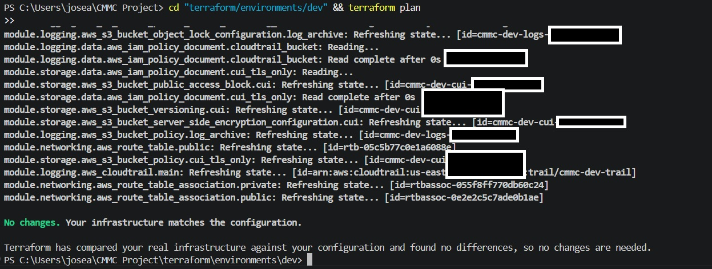
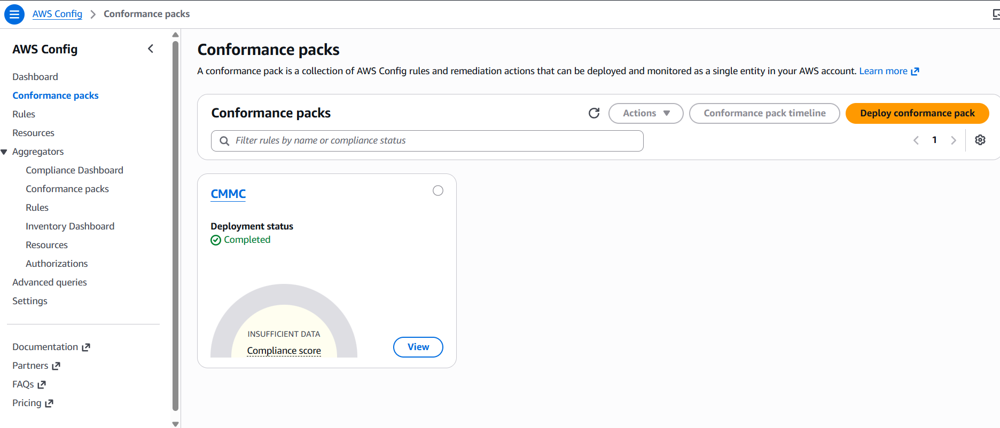
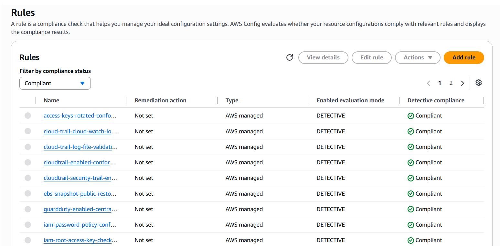
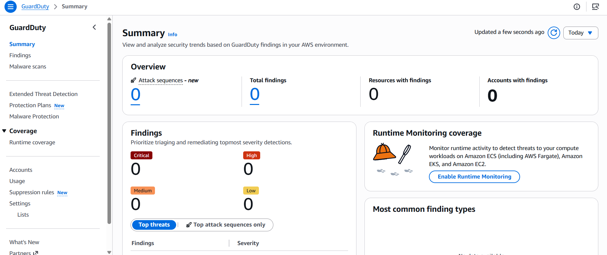
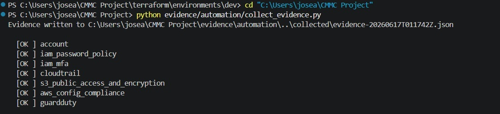
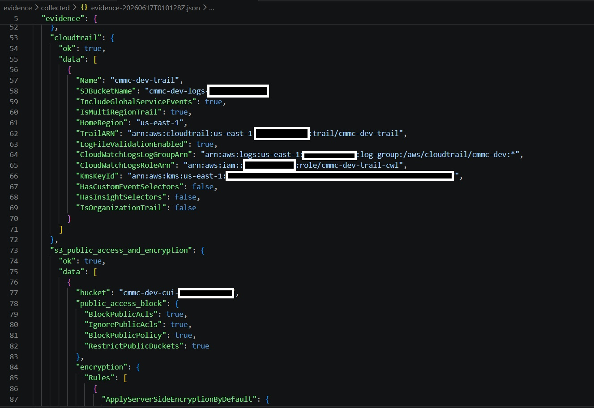
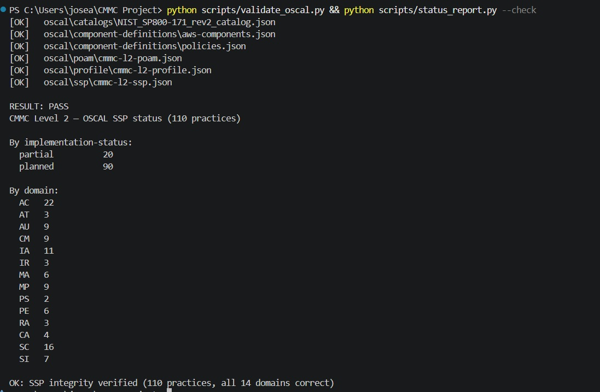
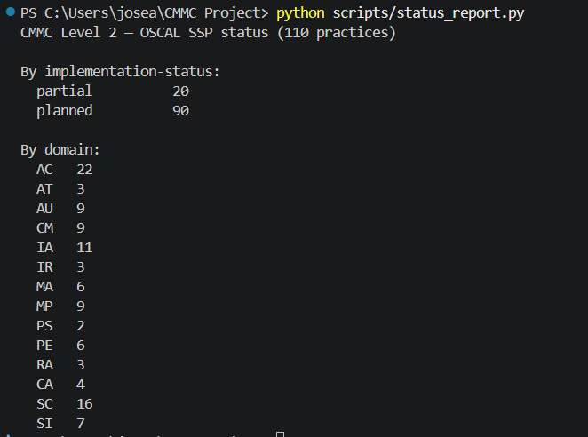
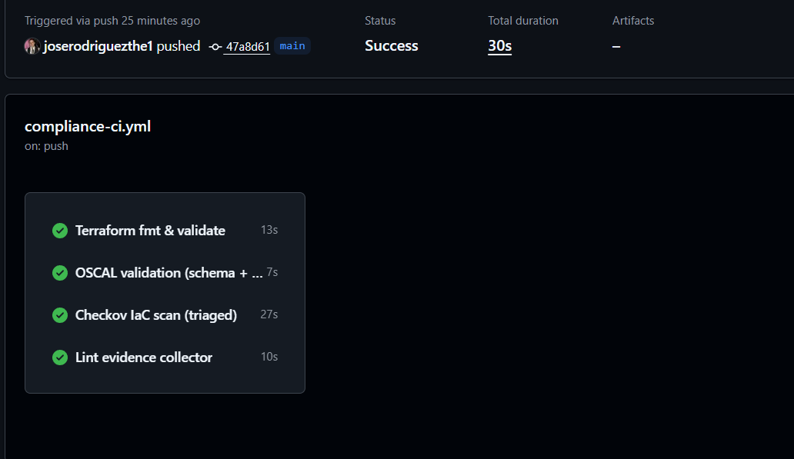

# CMMC GRC Engineering Project

<!-- After pushing to GitHub, replace joserodriguezthe1/cmmc-grc-engineering so these badges render live. -->
[](https://github.com/joserodriguezthe1/cmmc-grc-engineering/actions/workflows/compliance-ci.yml)


A **GRC-as-code** project that implements, enforces, and continuously monitors
**CMMC Level 2** (110 practices, aligned to NIST SP 800-171 Rev. 2) on **AWS**,
designed to stay within the **AWS Free Tier** wherever technically possible.

> **What this demonstrates (for reviewers):** the full GRC-engineering loop —
> control intent as **schema-valid OSCAL** → enforcement as **Terraform** →
> detection as **AWS Config** → **automated evidence** → gaps tracked in a
> **POA&M** → every change **gated in CI**. All 110 practices are version-
> controlled data, not prose. See [oscal/](oscal/).

This is not a documentation-only compliance binder. It treats compliance as an
engineering discipline:

- **Controls as data** — all compliance content lives as machine-readable **OSCAL** (NIST's standard) under `oscal/`.
- **Infrastructure as code** — security controls are deployed with Terraform.
- **Policy as code** — drift and misconfiguration are detected with AWS Config Conformance Packs.
- **Evidence as code** — audit artifacts are collected automatically by scripts/Lambda.
- **Validated in CI** — every change is linted, scanned, and policy-checked before merge.

---

## What is CMMC?

The **Cybersecurity Maturity Model Certification (CMMC) 2.0** is the U.S. Department
of Defense framework that contractors must meet to handle Federal Contract
Information (FCI) and Controlled Unclassified Information (CUI).

| Level | Data | Practices | Basis |
|-------|------|-----------|-------|
| Level 1 | FCI | 17 | FAR 52.204-21 |
| **Level 2** (this project) | CUI | **110** | NIST SP 800-171 Rev. 2 |
| Level 3 | CUI (advanced) | 110 + subset of 800-172 | NIST SP 800-172 |

This project targets **Level 2**.

---

## Repository layout

```
CMMC Project/
├── README.md                  ← you are here
├── oscal/                     ← compliance content as OSCAL JSON (source of truth)
│   ├── catalogs/              ← local NIST 800-171 Rev. 2 catalog (offline-resolvable)
│   ├── profile/               ← CMMC L2 profile (imports the local catalog)
│   ├── component-definitions/ ← AWS service components + policy components
│   ├── ssp/                   ← System Security Plan (all 110 implemented-requirements)
│   └── poam/                  ← Plan of Action & Milestones
├── docs/
│   └── architecture/          ← reference architecture, diagrams, cost notes (Markdown)
├── terraform/                 ← Infrastructure as code (technical controls)
│   ├── modules/
│   └── environments/
├── policy-as-code/            ← AWS Config Conformance Packs / OPA
├── evidence/                  ← automated evidence collection
│   ├── automation/
│   └── collected/
├── pipelines/                 ← CI/CD (GitHub Actions)
└── scripts/                   ← helper scripts (bootstrap, status report, etc.)
```

---

## How the layers map to CMMC

| Layer | Folder | CMMC domains primarily served |
|-------|--------|-------------------------------|
| Compliance content (OSCAL: SSP, profile, policies, POA&M) | `oscal/` | all 14 domains |
| Identity & access (Terraform) | `terraform/modules/iam` | AC, IA |
| Logging & audit (Terraform) | `terraform/modules/logging` | AU |
| Detection (Terraform) | `terraform/modules/security` | SI, CA |
| Data protection (Terraform) | `terraform/modules/storage` | SC, MP |
| Continuous monitoring | `policy-as-code/` | CA, CM |
| Evidence | `evidence/` | CA, AU |

---

## Deploy

The control baseline is deployed with Terraform and stays Free-Tier-safe by
default (paid services are feature-flagged off). Review the
[reference architecture](docs/architecture/architecture.md) and the
[Free Tier cost notes](docs/architecture/free-tier-cost-notes.md) before applying.

> **Prerequisites:** an AWS account, AWS CLI v2 configured, Terraform >= 1.6,
> Python 3.12. `make` targets wrap the common steps (`make help` lists them).

```bash
make validate                         # terraform + OSCAL schema + 110-practice check
cd terraform/environments/dev
cp terraform.tfvars.example terraform.tfvars   # set alert_email
terraform init && terraform plan      # review the baseline
terraform apply                       # deploy the Free-Tier-safe controls
```

```bash
# Optional: turn on continuous monitoring + collect evidence, then turn it off
terraform apply -var="enable_config=true" -var="enable_guardduty=true"
bash ../../policy-as-code/deploy-conformance-pack.sh
python ../../evidence/automation/collect_evidence.py
terraform apply -var="enable_config=false" -var="enable_guardduty=false"
```

When you're done, `make destroy` tears everything down to avoid charges.

---

## Proof it runs (live AWS deployment)

This isn't a paper exercise — the baseline was deployed to a real AWS account and
the **entire GRC loop** was exercised end to end. (Account IDs and ARNs redacted.)

### 1. Enforce — Terraform deploys the controls, drift-free (CM.L2-3.4.2)

`terraform plan` against the live environment reports no drift:



### 2. Monitor — AWS Config continuously verifies the controls (CA.L2-3.12.3)

The CMMC conformance pack deploys…



…and its rules evaluate **Compliant** — CloudTrail log-file validation, IAM
password policy, root access-key checks, GuardDuty enabled, and more:



### 3. Detect — GuardDuty watching the environment (SI.L2-3.14.6/3.14.7)



### 4. Evidence — collected automatically (CA.L2-3.12.1)

A read-only collector snapshots the live control state…



…into a timestamped, machine-readable artifact:



### 5. Govern — OSCAL validated, status tracked, every change CI-gated

OSCAL is schema-valid and all 110 practices are accounted for (CA.L2-3.12.4):





…and every change is gated in CI before merge (CM.L2-3.4.3/3.4.5):



---

## AWS Free Tier posture

This project is deliberately built to demonstrate CMMC controls **without a large
bill**. See [docs/architecture/free-tier-cost-notes.md](docs/architecture/free-tier-cost-notes.md)
for the per-service breakdown. In short:

- **Always free / negligible:** IAM, S3 (5 GB), CloudWatch Logs (5 GB), CloudTrail (1 trail), SNS, Lambda (1M req).
- **Free trial then paid — deploy with eyes open:** GuardDuty (30 days), Security Hub (30 days), AWS Config (charges per config item recorded).
- Cost-sensitive resources are **feature-flagged** in Terraform (`enable_guardduty`, `enable_config`, etc.) and default to a Free-Tier-safe setting.

> ⚠️ This is a learning/reference project. Nothing here makes you "CMMC certified."
> Certification requires a C3PAO assessment. This gives you the engineering
> backbone and evidence to get there.

---

## Status

The live implementation status of all 110 practices lives in the OSCAL SSP,
[oscal/ssp/cmmc-l2-ssp.json](oscal/ssp/cmmc-l2-ssp.json). For a human-readable
roll-up by domain and status:

```bash
python scripts/status_report.py
```

See [oscal/README.md](oscal/README.md) for how the OSCAL models fit together.
